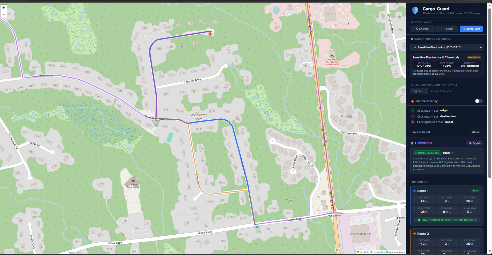
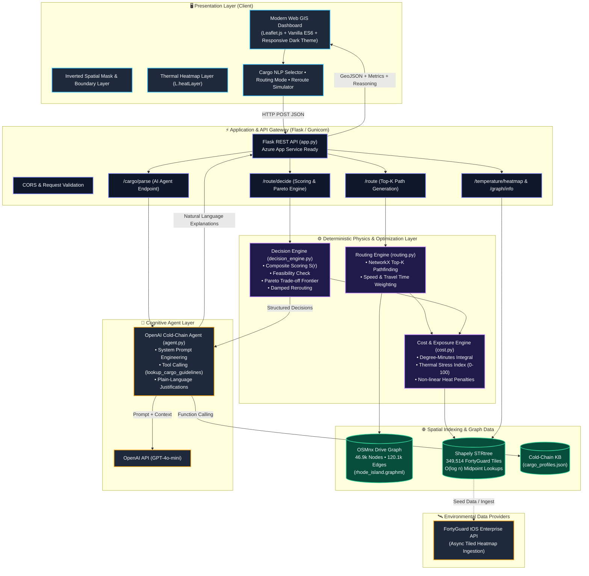
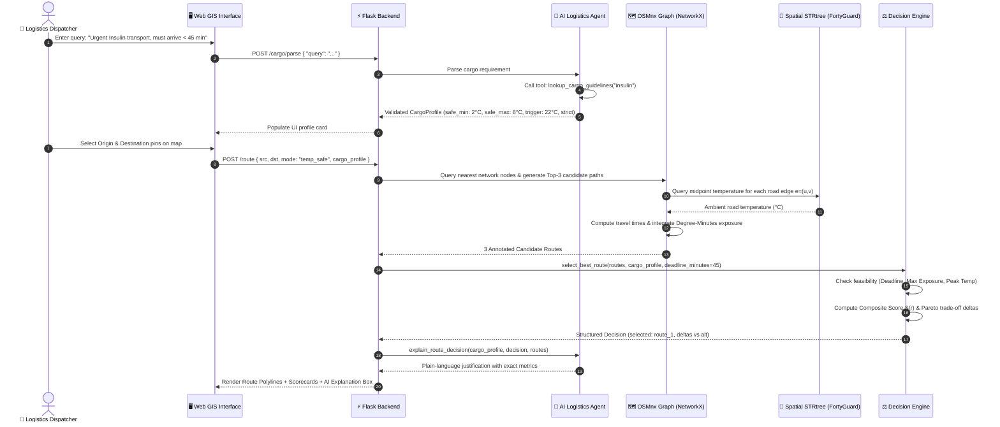

<div align="center">

# 🛡️ Cargo-Guard
### **Autonomous Thermal-Aware Routing & AI Decision Platform for Cold-Chain Logistics**

[](https://www.python.org/)
[](https://flask.palletsprojects.com/)
[](https://openai.com/)
[](https://fortyguard.com/)
[](https://osmnx.readthedocs.io/)
[](https://azure.microsoft.com/)

[🎯 System Overview](#-system-overview) • [✨ Key Features](#-key-features) • [🏗️ System Architecture](#️-system-architecture) • [🧠 Algorithmic Core](#-algorithmic--mathematical-core) • [🚀 Quick Start](#-quick-start--installation) • [🔌 API Documentation](#-api-documentation) • [🗺️ Roadmap](#️-roadmap)

<br/>



*Cargo-Guard Command Center: Real-time top-k multi-route pathfinding, thermal exposure analytics, AI agent decision reasoning, and spatial heat overlays.*

</div>

---

## 📌 Executive Summary

Every year, the global logistics sector suffers over **$35 Billion in cold-chain cargo losses** due to temperature abuse during ground transit. Traditional navigation systems (Google Maps, OSRM, standard GPS) optimize strictly for **distance** or **travel time**. They are entirely blind to urban microclimates, asphalt solar radiation, and extreme heat corridors. 

A refrigerated truck transporting sensitive biopharmaceuticals or deep-frozen goods might take a "faster" highway route, only to experience severe thermal degradation from asphalt radiating at 45°C+ during traffic slowdowns.

**Cargo-Guard** is an enterprise-grade autonomous logistics intelligence engine. By synthesizing hyperlocal **FortyGuard tOS** street-level thermal telemetry (~349,500+ spatial tiles), **OSMnx/NetworkX** road graphs, and an **autonomous OpenAI LLM decision agent**, Cargo-Guard dynamically routes, scores, monitors, and reroutes shipments based on **cumulative thermal exposure (Degree-Minutes)** and strict cargo safety envelopes.

---

## 🌟 Key Value Propositions

| Capability | Traditional Navigation (Google Maps / Waze) | Cargo-Guard Intelligence Platform |
| :--- | :--- | :--- |
| **Optimization Metric** | Distance (meters) or Travel Time (minutes) | **Multi-Objective:** Travel Time + Cumulative Thermal Exposure ($^\circ\text{C}\cdot\text{min}$) |
| **Thermal Awareness** | ❌ None (Ambient weather blind) | ✅ **Hyperlocal street-level asphalt temperature** (~100m resolution) |
| **Cargo Specialization** | ❌ Generic vehicle profile | ✅ **Strict Pydantic profiles** (Vaccines, Deep Freeze, Produce, Chemicals) |
| **Decision Intelligence** | ❌ Simple shortest-path heuristics | ✅ **Pareto trade-off frontier + Autonomous LLM reasoning** |
| **In-Transit Rerouting** | ❌ Reacts only to traffic accidents/congestion | ✅ **Thermal incident detection + Damped reroute evaluation** |

---

## ✨ Key Features

### 1. 🤖 AI Cold-Chain Agent with Autonomous Tool Calling
- Natural language cargo specification parsing (`"Transporting mRNA vaccines at 4°C with tight 30-min window"`).
- Integrates OpenAI Function Calling against a curated cold-chain knowledge base (`lookup_cargo_guidelines`) to produce strictly validated `CargoProfile` objects.
- Generates concise, executive-level natural language explanations justifying route selection and safety-vs-time trade-offs.

### 2. 🌡️ Hyperlocal Thermal Grid & Spatial STRtree
- Ingests **349,514 FortyGuard micro-climate tiles** across the operational zone.
- Backed by an in-memory **Shapely STRtree** for sub-millisecond $O(\log n)$ point-in-polygon and edge-midpoint temperature queries.
- Interactive Leaflet heatmap layer with normalized dynamic thermal gradients (3b82f6 Blue $\rightarrow$ ef4444 Red).

### 3. 🗺️ Deterministic Top-K Pathfinding Engine
- Enriched **OSMnx drivable network graph** (46,982+ nodes, 120,132+ edges) with real speed profiles and segment travel times.
- Evaluates Top-K candidate paths using NetworkX `shortest_simple_paths` under pluggable cost functions:
  - **Shortest**: Pure distance minimizer.
  - **Fastest**: Travel-time minimizer.
  - **Temp-Safe**: Travel time penalized non-linearly by cumulative thermal exceedance above cargo trigger thresholds.

### 4. ⚖️ Multi-Objective Pareto Decision Engine
- Quantifies route quality via **Cumulative Thermal Exposure (Degree-Minutes)** and a normalized **Thermal Stress Index (0–100)**.
- Evaluates feasibility against strict delivery deadlines, maximum permissible heat exposure, and critical thresholds.
- Computes Pareto frontiers: calculates exact marginal cost (e.g. `+3 min travel time saves 42% thermal exposure`).

### 5. 🔄 Dynamic In-Transit Rerouting Simulator
- Evaluates whether mid-journey thermal spikes justify diversion.
- Features **trip progress damping** (inhibits thrashing when delivery is $\ge 80\%$ complete) and enforces a 2.0x hard ETA ratio cap.

---

## 🖼️ Application Interface

<div align="center">
  
  <p><em>Figure 2: Multi-alternative routing comparison showing highway bypasses, ambient thermal metrics, and safety scorecards.</em></p>
</div>

---

## 🏗️ System Architecture



---

## 🔄 End-to-End Execution Workflow



---

## 🧠 Algorithmic & Mathematical Core

### 1. Temperature-Penalized Road Edge Weight
When pathfinding under `temp_safe` mode, the impedance $w_e$ of each road edge $e$ is weighted dynamically using travel time $t_e$, ambient road surface temperature $T_e$, cargo safety trigger threshold $T_{\text{safe}}$, and the cargo's sensitivity parameter $\alpha$:

$$w_e = t_e \times \left(1.0 + \alpha \times \max\left(0,\, T_e - T_{\text{safe}}\right)\right)$$

- If $T_e \le T_{\text{safe}}$: Edge cost equals raw traversal time $t_e$.
- If $T_e > T_{\text{safe}}$: Cost scales linearly with temperature exceedance, actively penalizing heat corridors.

### 2. Cumulative Thermal Exposure (Degree-Minutes)
Thermal degradation is cumulative. A brief pass through a hot street is safe; a prolonged crawl is catastrophic. Cargo-Guard integrates temperature exceedance over transit time along path $P$:

$$\text{ThermalExposure}(P) = \sum_{e \in P} \max\left(0,\, T_e - T_{\text{safe}}\right) \times \left(\frac{t_e}{60}\right) \quad [^\circ\text{C}\cdot\text{minute}]$$

### 3. Non-Linear Thermal Stress Index (0 – 100)
To present operators with a rapid risk index, exposure is mapped into a normalized stress score parameterized by cargo tolerance:

$$\text{Stress Score} = \min\left(100.0,\, \left(\frac{\text{ThermalExposure}}{\text{MaxAllowedExposure}}\right)^{1.25} \times 100\right)$$

### 4. Multi-Objective Composite Route Scoring
Candidate routes are ranked using a multi-criteria objective function balancing normalized duration, normalized thermal exposure, and penalty violations:

$$S(r) = w_{\text{time}} \cdot \left(\frac{\text{ETA}(r)}{\min_{k} \text{ETA}}\right) + w_{\text{safety}} \cdot \left(\frac{\text{Exposure}(r) + 1.0}{\min_{k} \text{Exposure} + 1.0}\right) + \sum \text{Penalties}$$

*A route is flagged **Infeasible** if $\text{ETA} > \text{Deadline}$, $\text{Exposure} > \text{MaxAllowed}$, or $\text{PeakTemp} > T_{\text{critical}}$.*

### 5. Damped In-Transit Rerouting Policy
During live transit monitoring, rerouting is only triggered when the alternative path demonstrates proven risk reduction without excessive delay:
- **Progress Damping**: Rerouting is suppressed if trip completion $p \ge 80\%$ (prevents destination-approach thrashing).
- **Minimum Improvement**: Requires $\Delta \text{Exposure} \ge 15\%$ or $\Delta \text{Stress} \ge 15.0$.
- **Hard ETA Cap**: Alternative route ETA cannot exceed $2.0 \times$ current remaining ETA.

---

## 🛠️ Technology Stack

```
Frontend               Backend & Routing           AI & Spatial Intelligence
──────────────────     ───────────────────────     ─────────────────────────
• Vanilla HTML5 / ES6  • Python 3.11               • OpenAI GPT-4o-mini
• Leaflet.js (GIS)     • Flask 3.1.3 & CORS        • OpenAI Function Calling
• Leaflet.heat         • Gunicorn WSGI             • FortyGuard tOS API
• Custom CSS Glass     • OSMnx 2.1.1 (OpenStreet)  • Shapely 2.1 STRtree
• Semantic Dark HUD    • NetworkX 3.6.1 (Graphs)   • Pydantic 2.13 Validation
```

---

## 📁 Repository Structure

```
Cargo-Guard/
├── .github/
│   └── workflows/
│       └── main_cargo-guard-api.yml     # Azure App Service CI/CD deployment pipeline
├── backend/
│   ├── data/
│   │   ├── cargo_profiles.json          # Cold-chain thermal guideline knowledge base
│   │   ├── rhode_island.graphml         # Pre-built OSMnx road network graph
│   │   ├── rhode_island_boundary.json   # State boundary GeoJSON MultiPolygon
│   │   └── ri_heatmap_cache.json        # Cached 349.5k FortyGuard thermal tiles
│   ├── library/
│   │   └── Cargo-Guard-Phase-3-6...md   # Comprehensive engineering design specifications
│   ├── agent.py                         # OpenAI LLM agent & function-calling interface
│   ├── app.py                           # Flask REST API server & background init thread
│   ├── cargo_profiles.py                # Pydantic models & knowledge base query tool
│   ├── cost.py                          # Edge cost functions & thermal exposure integrals
│   ├── decision_engine.py               # Deterministic multi-objective decision & reroute engine
│   ├── fortyguard_client.py             # FortyGuard tOS API client & dynamic tile partitioner
│   ├── graph_loader.py                  # Road network loader & boundary extractor
│   ├── requirements.txt                 # Backend Python package dependencies
│   ├── routing.py                       # Top-K pathfinding algorithms & telemetry builder
│   └── temp_grid.py                     # Shapely STRtree spatial thermal indexing
├── frontend/
│   ├── static/
│   │   └── images/
│   │       ├── image.png                # Full interface UI screenshot
│   │       └── image copy.png           # Multi-route alternative comparison screenshot
│   ├── index.html                       # Single-page GIS dashboard interface
│   ├── map.js                           # Leaflet map controller & async API client
│   └── style.css                        # Glassmorphism dark-theme styling & HUD layout
├── ri_heatmap_cache.zip                 # Compressed backup of FortyGuard thermal cache
├── .gitignore                           # Repository ignore rules
└── README.md                            # Project documentation
```

---

## 🚀 Quick Start & Installation

### Prerequisites
- **Python 3.11+** installed on your system.
- **Git** installed.
- *(Optional)* **OpenAI API Key** (for natural language parsing & AI explanation features).

### 1. Clone the Repository
```bash
git clone https://github.com/your-username/Cargo-Guard.git
cd Cargo-Guard
```

### 2. Set Up Virtual Environment & Dependencies
```bash
# Navigate to backend
cd backend

# Create virtual environment
python -m venv .venv

# Activate virtual environment
# On Windows (PowerShell):
.\.venv\Scripts\Activate.ps1
# On Linux / macOS:
source .venv/bin/activate

# Install dependencies
pip install -r requirements.txt
```

### 3. Configure Environment Variables
Create a `.env` file inside `backend/`:
```env
# Optional: OpenAI API Configuration (for AI Agent features)
OPENAI_API_KEY=your_openai_api_key_here
OPENAI_MODEL_NAME=gpt-4o-mini

# Optional: FortyGuard tOS Enterprise API (if refreshing live heatmap)
FORTYGUARD_API_KEY=your_fortyguard_key_here
```

### 4. Run the Application
```bash
python app.py
```
*The server will start at `http://127.0.0.1:5000`.*

Open your browser and navigate to:
```
http://127.0.0.1:5000/
```

---

## 🔌 API Documentation

| Method | Endpoint | Description | Request Payload / Params |
| :--- | :--- | :--- | :--- |
| `GET` | `/health` | Service health, node count, and initialization status | None |
| `GET` | `/graph/info` | Road network metadata & state boundary polygon | None |
| `GET` | `/temperature/heatmap` | Aggregated FortyGuard heat points for frontend thermal overlay | None |
| `GET` | `/cargo/profiles` | List built-in cargo profiles (vaccines, frozen, produce, etc.) | None |
| `POST` | `/cargo/parse` | Parse natural language query into validated `CargoProfile` | `{"query": "Insulin at 4C"}` |
| `POST` | `/route` | Calculate Top-K routes with speed, length, and thermal exposure | `{"src_lat": float, "src_lng": float, "dst_lat": float, "dst_lng": float, "mode": "temp_safe", "cargo_profile": {...}}` |
| `POST` | `/route/decide` | Evaluate candidate routes, generate composite scores & AI explanation | `{"routes": [...], "cargo_profile": {...}, "deadline_minutes": 45, "explain": true}` |
| `POST` | `/route/reroute-eval` | Evaluate in-transit reroute decision at current trip progress | `{"current_route": {...}, "alt_route": {...}, "cargo_profile": {...}, "trip_progress_pct": 50}` |

---

## ☁️ Deployment & CI/CD Architecture

Cargo-Guard is pre-configured for automated continuous deployment to **Microsoft Azure App Service** via GitHub Actions (`.github/workflows/main_cargo-guard-api.yml`):

1. **Build Job**:
   - Checks out the repository and initializes submodules.
   - Installs dependencies into an isolated `.python_packages` bundle.
   - Bundles the FortyGuard SDK and packages application artifacts.
2. **Deploy Job**:
   - Deploys the artifact to the production slot of the Azure Web App `cargo-guard-api`.
   - Served securely through **Gunicorn** multi-worker WSGI processes.

---

## 🧪 Testing & Verification

Run automated module validation using the Python test runner:
```bash
# Validate core routing and decision algorithms
python -c "import app, decision_engine, cost, cargo_profiles; print('✅ All core engines verified!')"

# Test API endpoints using Flask test client
python -c "import app; c = app.app.test_client(); assert c.get('/graph/info').status_code == 200; print('✅ /graph/info operational!')"
```

---

## 🗺️ Roadmap

- [x] **Phase 1: Deterministic Routing Engine** (OSMnx road graph, speeds, travel times, Top-K alternatives).
- [x] **Phase 2: Hyperlocal Thermal Intelligence** (FortyGuard 349k tile ingestion, STRtree spatial index, thermal overlay).
- [x] **Phase 3: Cargo-Aware Decision Engine** (Degree-Minutes cumulative exposure, composite scoring, Pareto frontier).
- [x] **Phase 4: AI Cold-Chain Agent** (OpenAI tool-calling agent, structured Pydantic profiles, plain-language explanations).
- [x] **Phase 5: Inverted Regional Masking** (High-visibility operational zone focus and boundary highlighting).
- [ ] **Phase 6: Multi-City Global Expansion** (Dynamic AOI bounding boxes for Phoenix, Dubai, Singapore).
- [ ] **Phase 7: Real-Time IoT Reefer Telemetry** (MQTT ingestion of live trailer temperatures & door-open events).
- [ ] **Phase 8: Time-Dependent Dynamic Heat Forecasting** (Hourly asphalt cooling/heating models).

---

## 👥 Authors & Acknowledgments

- **Cargo-Guard Engineering Team**
- **FortyGuard** — Hyperlocal urban heat data and tOS API sandbox.
- **OpenStreetMap & OSMnx Contributors** — Open-source geographic road networks.

---

## 📜 License

This project is licensed under the [MIT License](LICENSE).
